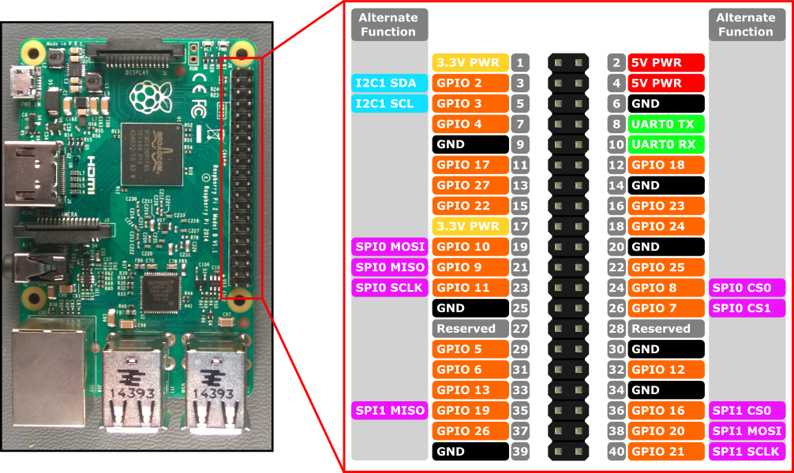

Mephisto II
===========

Deployment
--------

- Clone https://github.com/syd711/callete.git into the homefolder of your pi.
- Invoke the __make.sh__ script 
- Start the deployment server: __~/callete/callete-deployment $ ./startServer.sh__
- Check the callete.properties for the target system.
- Check the details of root pom.xml for the DeploymentArchiver.

Then run:

__mvn clean install -Pdeploy__

UI
--------

Ensure to invoke the whole path to the __index.html__ (!!!), e.g. __http://127.0.0.1:8080/resources/index.html__

Wiring 
--------

Note that the pins set in the __callete.properties__ match the pin number, not the GPIO numbers.
E.g. pin #3 is GPIO 3.

Pin 2 and pin 6 are used for +5V and GND. Check the '+' and '-' symbol on the cobbler board to see the connections.

# About This Project

Motivation
--------
Inspired by mightyohms internet radio I decided to build one on my own too. 
So I build my first radio with an Asus WL520-GU router and an Arduino Ethernet as UI controller: Mephisto I.

The project has been so much fun that I decided to build another one, but with a cheaper and more efficient hardware 
by choosing the Raspberry Pi.

The finished radio.

The Name
--------
Why Mephisto II? Well, my last name means "fist" in German (Faust) and this is the second radio I build, so...

## The Cabinet

What? Wait? Why starting with the cabinet? Well, I learned from my first project that I neither have the tools nor the room 
to build a box on my own. So I decided to lookup a possible box first and
build the radio depending on the design of the choosen box. 
The radio is a gift for a woman who's got an old-fashioned furniture style, 
so I bought a radio box from 1932 from ebay and started "hacking".

## Components Used

- Radio box
- Raspberry Pi
- Raspberry Pi GPIO Cobbler
- Lepai Mini Hi-Fi HiFi Stereo Audio Amplifier
- USB Hub 4-port
- Visaton BG 20 speaker
- 2x 74HC595 8 bit shift register
- USB power adapter for the Raspi
- power adapter for the Lepai amp
- a relay that switches the power source for the Raspi once the amp is turned on
- 12x LED for the front display
- 1x LED as power indicator on the front (the 3mm hole was already there, so I used this as for a power LED)
rotary encoder for station selection
- on/off switch
- ...and blood, sweat and tears ;)

